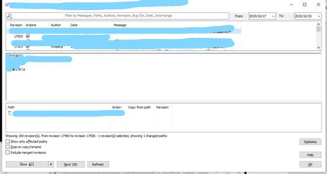
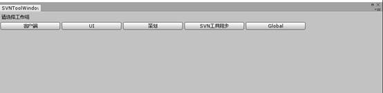

**SVN****同步工具使用方法**

Write by Dead-Rabbit

工具包含SVN同步工具 【配置工具】和 【快速同步工具】

文档后附有 **一般操作流程**

快速同步工具

**路径**：      Tools -> SVN -> SVN快速同步

**快捷键**：    Shift + Alt + M

注：**第一次使用工具** 或 **重装Unity** 需要打开下面的【配置工具】来选择工作组

快速同步工具会检查当前在【配置工具】中选择的工作组下所有的 **已选同步预设**，具体配置方式在下面的【配置工具】中查看

一、在快速同步工具会 逐一检查 配置的单个文件，并将可同步的文件合并在一起使用TortoiseSVN工具进行Commit操作

二、工具检查完文件后，会逐个检查同步工具中配置的 文件夹，如果文件夹下存在可提交内容，则会唤起TortoiseSVN关于该文件夹的Commit操作

三、当当前操作存在可提交的文件夹和文件时，且在用户完成所有Commit操作后（无论提交与否），会唤起TortoiseSVN工具中的Log工具，查看根目录下所有提交记录

 

配置工具

**路径**：      Tools -> SVN -> SVN同步编辑工具

**快捷键**：    Shift + Alt + i

## 工具介绍

#### 选择工作组

①  选择工作组，根据使用者工作类型

②  当修改了SVN配置后，使用【SVN同步工具】来上传配置

③  Global下的配置为新建配置提供基础配置

 

目前仅支持在C#代码中添加新的工作组，方法为：

\1.   打开 \MProject\Assets\Tools\Editor\UESVNTool\SVNToolWindow.cs

\2.   在变量 m_SvnWorkingGroup 中追加新的工作组名称

\3.   打开SVN配置工具，选择目标工作组，进行配置后即可。使用前需要进行配置，配置方法请查看下面的介绍

#### 选择预设与提交

1、 配置的预设列表

a)   同步：勾选同步后，在提交中生效，若未勾选，则不会同步文件、文件夹状态，以及不会参与提交过程，且不会出现在【快速同步工具】的提交列表中

b)   中间为配置的预设名称

c)   查看：点击查看后，会更换选择的预设为当前的预设

2、 【开启配置】：点击后开启配置，进入配置界面

3、 当前所选预设的同步状态。

a)   【刷新同步】点击后刷新当前所选预设的同步状态

b)   如果显示 同步中… ，则表示当前正在获取SVN文件、文件夹状态，请勿操作

c)   在预设中配置的文件，如果存在可提交内容，则会显示；如果不存在可提交内容，则不会显示。

一、左侧勾选后，会出现在**图中④**的已选列表中

二、【Find】    在文件管理器中显示该文件

三、【完整路径】    显示文件在SVN中的路径

四、【查看差异】    唤出界面，查看当前文件和SVN库里文件的差异

d)   在预设中配置的文件夹。

一、如果不存在可提交内容，则会置灰

\1.   【打开文件夹】   在文件管理器中显示该文件夹

二、如果存在可提交内容，则显示文件夹下所有可提交文件夹

\1.   【取消选择】 点击后会取消选择全部内容

\2.   【打开文件夹】   在文件管理器中显示该文件夹

\3.   点击文件夹名称会 折叠 文件夹中文件列表

三、如果所配置的文件夹存在新增、删除的操作，会显示【存在新建，以及文件夹操作，请点击此处】按钮，点击后会调用TortoiseSVN工具，对该文件夹进行Commit操作

4、 点击窗口最下的提交后，会提交当前所选文件

 

#### 配置操作

\1.   配置预设

a)   【注销】点击后，退出当前操作组，恢复到【选择工作组】界面中

b)   【新增】点击后，新增预设

c)   【删除】点击后，删除当前界面中选择的预设

d)   【保存】点击后，保存当前配置到配置文件中，如果Unity客户端出现了权限报错，请查看并修改SVN同步工具中保存的 所选工作组.json 文件的可写属性，配置文件路径为：MProject\Assets\Tools\Editor\UESVNTool\SVNToolSource\所选工作组.json

\2.   预设列表

a)   输入框中为预设名称

b)   【查看】点击后可以在右侧配置当前选择的预设

\3.   预设配置列表。当前展示左侧选择的预设所配置的内容，用户可拖拽文件、文件夹到区域中进行配置

配置内容分为

a)   文件夹

\1.   【打开文件夹】按钮点击后会打开文件管理器中对应的位置

\2.   【Del】点击后会删除预设中的这一项配置

b)  文件

\1.   【Del】点击后会删除预设中的这一项配置

一般使用流程

\1.   第一次使用快速同步工具之前，需要打开【SVN同步配置工具】，

a)   寻找 Tools -> SVN -> SVN同步编辑工具

\2.   点开后选择工作组，选择好工作组后，如果不需要对SVN快速同步进行修改配置的话，可以关闭当前配置窗口了，按快捷键Shift + Alt + M可进行快速同步

\3.   下面的内容是对SVN同步工具的配置操作

\4.   右上角显示“同步中…”，表示当前在同步，请勿操作

\5.   同步完成后，当前显示在配置的预设中，当前可进行Commit操作的文件和文件夹

\6.   点击【开启配置】按钮，进入配置界面

\7.   在这个界面中对所选预设进行配置，增删预设、文件、文件夹，具体操作参见【配置工具】中的【配置操作】

\8.   配置后，点击【保存】，完成